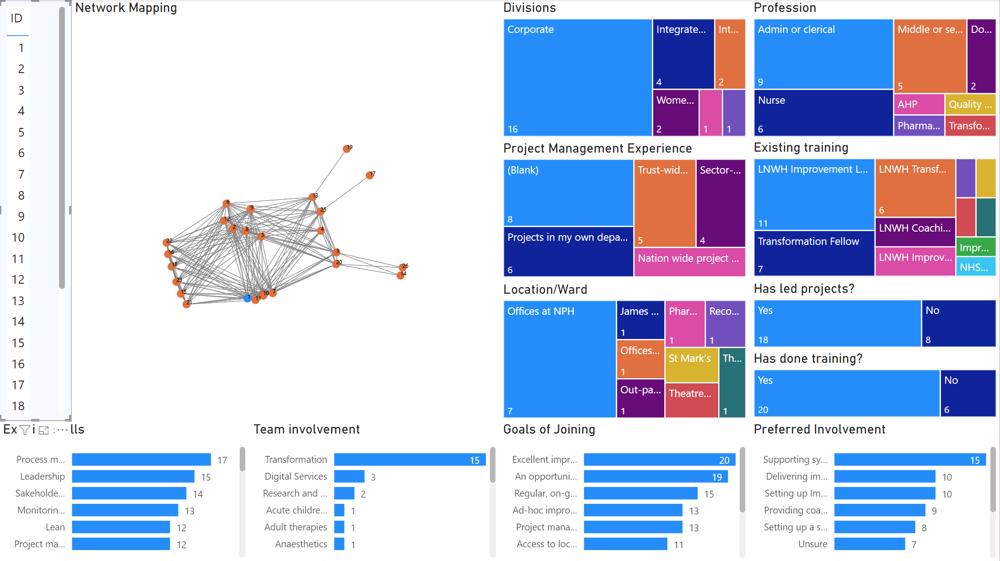

During LBS, I also engaged with an NHS Trust on a part-time analytic engagement, with the goal to identify and visualise the network of experts on different fields across the Trust, with a focus on their continuous improvement background and interest. For convenience, we worked only on excel and PowerBI so we could easily handover the tool to the NHS Trust after the engagement. Here is the sample output of the analysis

This is particularly interactive and powerful for the Program/Continuous Improvement Office to keep track of improvement readiness across the organisation, including training provided, past experience, and key topics for improvement. Network are generated based on hierachy, day to day relationship based on project work or work deployment, with tiering system on proximity of connection (e.g., distanced vs closely connected)
