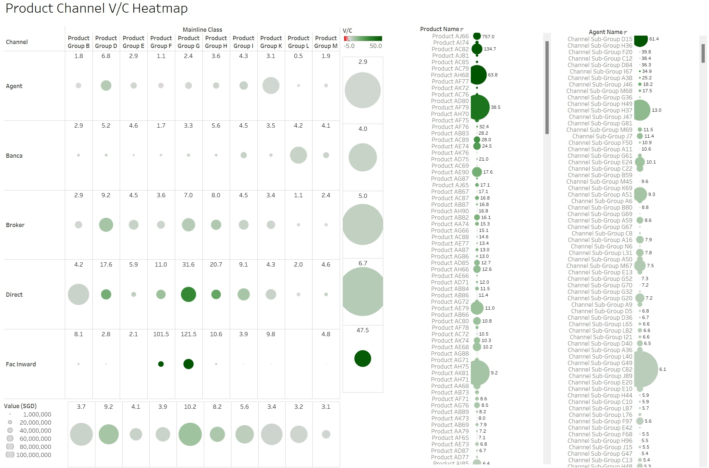

One of my most proud achievement during my time at Strategy& were my "Reimagine the Possible" award. This were given as a recognition for my effort to successfully lead a team of technical consultants to revolutionise how our digital offerings on operational and financial management analytics could be more effective for top leadership to make informed strategic decisions. Here are some key challenges we were able to solve with our latest digital offerings

The first key challenge was to establish a zero-base baselining the total cost of doing businesses across the organisation. Here is an example analytical output where human efforts are quantified in FTE (full-time employee i.e., time spent on the activities) and cost (per salary/human cost paid) for an organisation with 1000+ employees

<!-- -->
This gives incredible insight on how companies are spending their employee time e.g., if most of the efforts are spent on value adding activities. An important item to note is that we must be adequately specific with the definition of activities, but not too specific that it could either over complicate the analysis, or send the wrong the message (e.g., lunch or bathroom break should be removed from the equation to protect data integrity), it is best when aligned with hypothesis we look to evaluate. The next incredible ability of the tool (that is removed from view due to confidentiality) is ability to view the analysis by department, or type of activities, or different type of cost involved, allowing for a powerful visualisation of cost.

The second key challenge is to link the costs to specific distribution channels and/or products. Here is an example of the product and channel analysis done with +1bn lines of transaction data across a year. 

<!-- -->
This is a very powerful visualisation of business sizes by product groups and channels, as well as their profitability level, similarly for the each individual products and sub channels. Data can be further filtered by business areas, customer types, and we can also add customer group dimensions into the mix. Moreover, the ability to tweak profitability by different calculation method e.g., accounting methods also allow adaptability of the tool for different uses
